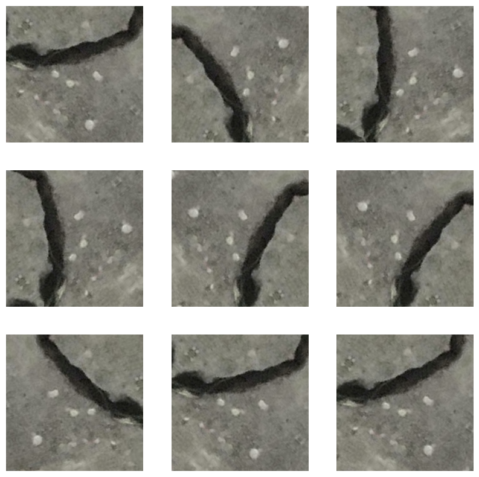

# Concrete Crack Image Classification

The Concrete Cracks Image Classification project uses deep learning to categorize images into positive (concrete cracks) and negative (no concrete cracks) categories. Transfer learning is utilized to fine-tune a pre-trained model on a dataset of thousands of images to achieve high classification accuracy. Results include a trained model and visualizations/metrics providing insights into model performance.

# Acknowledgment of Data 💕

The project is made possible with the dataset obtained from:

[Çağlar Fırat Özgenel's Concrete Crack Images for Classification](https://data.mendeley.com/datasets/5y9wdsg2zt/2)

## Build With

  
  
  
  
  
  
  
  

# Directory structure

- [training.py](): Contains code for loading/preprocessing data, defining/compiling/fitting the transfer learning model.

- [pictures](): Folder containing plots and results, including confusion matrix and training/validation accuracy/loss graphs.

- [saved_models](): Folder containing saved trained model.

- [model.png](): Model architecture for the base model (MobileV2Net)

# Results

## EDA

The plot below shows 9 examples of images and their corresponding labels in this dataset.

## Image Augmentation

This section demonstrates the use of data augmentation to enhance the model's performance and expand the dataset. It showcases images transformed using various techniques such as rotation, and flip.

## Model Architecture

The model architecture is based on MobileNetV2 with a global average pooling layer and a dropout layer, followed by a dense layer with 2 output units for binary classification.

Here is a summary of the model architecture:

## Evaluation Before and After Training

This section shows the evaluation metrics (accuracy and loss) of the model before and after training.

## Tensorboard Result

The two plots below show the training progress of the LSTM model using TensorBoard.

The first plot shows the epoch loss for both the training and validation datasets. The loss is calculated as the difference between the predicted and actual values for each time step, and the lower the loss, the better the model performs.

The second plot shows the epoch accuracy for both the training and validation datasets. Accuracy is a metric used to evaluate the performance of the model, and it measures the percentage of correct predictions made by the model. The higher the accuracy, the better the model performs.

## Classification Report

## Confusion Matrix

## Model Predictions on Test Data

This section shows some examples of the model's predictions on the test dataset

## Predicted vs True Label

This section shows plots of the predicted labels vs. the true labels for the test dataset.

